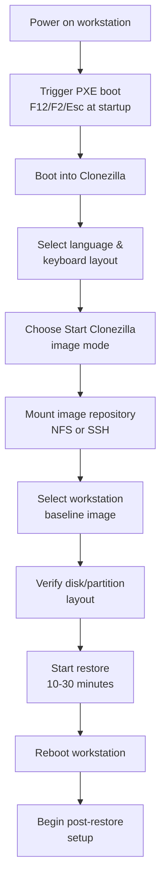

# Lab management and system administration

This page guides you on how to manage the lab. Make sure you've gone through [Infrastructure](infra.md) first.

## Onboarding a new AI X Lab employee
- [ ] Generate an SSH key (`ed25519`)
- [ ] Upload your public key to the workstations
- [ ] Verify access by pinging the fleet with Ansible
- [ ] Get access to the Synology NAS (credentials, share mounts)

## Equipment and Inventory

If you have internal access, equipment inventory is listed [here](https://novasbe365.sharepoint.com/:x:/r/sites/D3Institute/Shared%20Documents/01.%20AI%20Experimentation%20Lab/09.%20Equipment/D3_AIXLab_Inventory_2026.xlsx?d=w12fc23e8e89b419ba38152fd8f22bcc2&csf=1&web=1&e=SZdLSl).


### Maintenance
System updates (when, how, which playbook)
Clearing `/data` on workstations
Checking free space on workstations and on the NAS
Replacing or reimaging a workstation

## Internet access
credentials and hotspots


## Set-up a new workstation

### System image restoration via Clonezilla

Workstations are provisioned using PXE boot and Clonezilla image restore. The process takes 10–30 minutes depending on image size.


```text
Select a driver:

❯ nvidia-driver-575 (recommended)
  nvidia-driver-570
  nvidia-driver-550
  nouveau
```



#### Detailed steps

**1. Boot via PXE**
- Power on the workstation and immediately trigger PXE boot (consult BIOS for boot menu key)
- The workstation should automatically connect to the PXE server and boot into Clonezilla

**2. Start Clonezilla**
- Select language and keyboard layout
- Choose **"Start Clonezilla"** (not "Clonezilla lite-server")
- Select **image mode** (restore from a saved image)

**3. Mount the image repository**
- Select storage method: **NFS** or **SSH**
- Mount point: `[PLACEHOLDER_IMAGE_SERVER]`
- Image path: `[PLACEHOLDER_IMAGE_FOLDER]`
- Authenticate if required

**4. Select the image**
- Browse and select the standard workstation image (e.g., `workstation-baseline`)
- Confirm image details: size, creation date, included partitions

**5. Configure restore options**
- Optionally check image integrity before restoring
- Disk/partition selection:
  - Full disk restore: select target disk (usually `/dev/sda`)
  - Partition restore: select specific partitions
- Bootloader: skip GRUB if included in image; configure otherwise

**6. Verify and execute**
- Review the restore summary (source, target, partitions)
- **Confirm target disk** — this will overwrite all data
- Start restore and wait for completion

**7. Reboot**
- Once complete, reboot the workstation
- Proceed to post-restore setup

### Post-restore configuration

After the system image has been restored:

- Set the hostname (e.g., `workstation-01`)
- Create the `labadmin` and `participant` accounts
- Configure passwordless auto-login for `participant`
- Create `/data` with correct cross-account permissions
- Install and configure eduroam with an assigned `userN` credential set
- Install SSH server and deploy authorized keys from the NAS
- Add the workstation to the relevant inventory file(s)
- Smoke test against the new host

## Accessing and managing the Synology NAS
Directory layout under `/datadump`
Accessing the NAS from a workstation vs. from a personal machine
Retention and archival expectations
Restoring or re-syncing data if a backup step failed


## Troubleshooting
Workstation unreachable via Ansible
`/data` permission errors
eduroam connection dropped
Auto-login not working after reboot
Backup to NAS failed or incomplete
