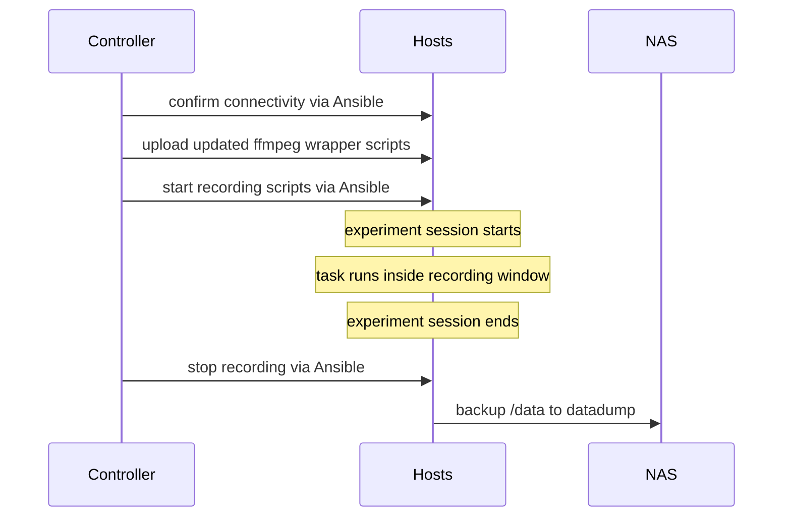
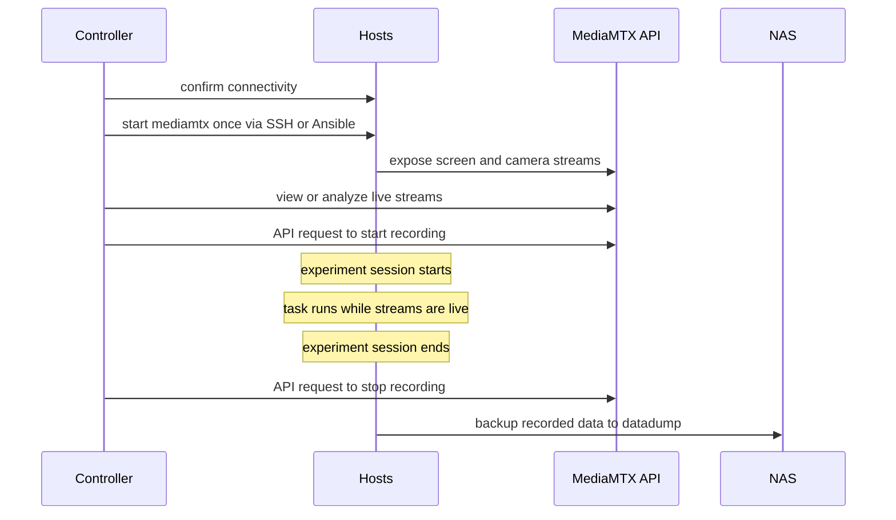

# Experiment setup and execution

Audience: researchers and operators running studies. Read often, sometimes under time pressure right before a session.

Recordings in the lab are **agnostic to the experiment structure**. The recording infrastructure starts, stops, and backs up data in the same way regardless of whether the task is a cognitive experiment, an AI workshop, a behavioural session, or another protocol. The experimental task runs *inside* the recording window; it does not define how recordings are managed.

Before running a session, all experimental computers / hosts should be correctly configured:

- Each host has a **unique hostname**, e.g. `workstation-01`.
- Each host uses the **matching LAN IP address**, e.g. `192.168.10.101` for workstation 1.
- Each host is listed in the correct inventory or configuration file for the experiment.
- Each host has the required recording devices connected, especially the 360° camera.
- Each host has a writable `/data` directory for local recordings, when local recording is used.
- The controller machine can reach the hosts over the lab LAN.

## Method 1 - Ansible local recording

This method uses Ansible to start and stop local recording processes on each host. Each workstation records its own streams locally using shell scripts that wrap `ffmpeg`. At the end of the session, recordings are copied from each host's `/data` directory to the Synology NAS `datadump` share.

This is the simplest and most robust default workflow: recordings stay local during acquisition, network traffic is low while the task is running, and backup happens only after the session ends.

### Session timeline

A typical experiment session follows this sequence. The recording window intentionally surrounds the experimental task, so any task-specific software or instructions can vary without changing the acquisition workflow.



### Setting up a new experiment

Create one Ansible inventory file per experiment or experiment configuration. The inventory defines which hosts participate in the session and allows playbooks to target only the relevant machines.

Checklist:

- [ ] Select which workstations are involved.
- [ ] Confirm each selected workstation has the expected hostname and LAN IP address.
- [ ] Confirm each selected workstation has the required camera and peripherals connected.
- [ ] Create or update the experiment inventory file.
- [ ] Prepare any task files, configuration files, or stimulus files that need to be uploaded to the hosts.
- [ ] Dry run on a single workstation before going fleet-wide.

!!! info "Ansible artefacts"
    Placeholder repository: `[PLACEHOLDER_ANSIBLE_GIT_REPO_URL]`

    Placeholder inventory file: `[PLACEHOLDER_ANSIBLE_INVENTORY_FILE_URL]`

    Placeholder playbook directory: `[PLACEHOLDER_ANSIBLE_PLAYBOOK_DIRECTORY_URL]`

### Pre-session preparation

#### 1. Confirm host connectivity

From the controller machine, confirm that Ansible can reach every host in the selected inventory before participants enter the room.

```text
Pre-session connectivity check:

❯ all hosts reachable via Ansible
  one or more hosts unreachable
  inventory file missing or incorrect
  SSH key/authentication issue
```

If any host is unreachable, fix the network, hostname, IP address, or SSH issue before continuing.

#### 2. Upload the recording scripts

Recording is controlled by shell scripts on each host. These scripts are wrappers around `ffmpeg` and should be uploaded before each session if they were updated.

Typical wrappers include:

- `record-screen.sh` — starts screen recording.
- `record-camera.sh` — starts camera recording.
- Additional device-specific scripts if the experiment uses extra sensors.

Use the Ansible upload playbook to send the current scripts to every selected host.

!!! info "Script upload playbook"
    Placeholder playbook: `[PLACEHOLDER_UPLOAD_RECORDING_SCRIPTS_PLAYBOOK_URL]`

The scripts should write recordings into the host's local `/data` directory, using one subfolder per recording stream, e.g. `/data/screen` and `/data/owl`.

#### 3. Verify devices before starting

Before starting the session, confirm that the expected recording devices are visible on each host.

```text
Device readiness:

❯ screen capture available
  camera connected and detected
  /data writable
  enough local disk space
```

### Running a session

#### 1. Start recording

Start the recording scripts on all selected hosts via Ansible. This toggles acquisition on the fleet without manually touching each workstation.

!!! info "Start recording playbook"
    Placeholder playbook: `[PLACEHOLDER_START_RECORDING_PLAYBOOK_URL]`

The playbook should start the relevant `.sh` wrappers in the background on each host, usually under the `participant` account so recordings run in the participant session environment.

```text
Recording start:

❯ start screen recording
  start camera recording
  confirm recording processes are running
  report failed hosts
```

Do not start the experimental task until recording has started successfully on all required hosts.

#### 2. Run the experiment session

Once recording is active, begin the experimental session. The task can be any study-specific procedure: browser task, Python application, workshop activity, survey, video call, behavioural protocol, etc.

!!! tip
    The task should fit inside the recording window: start recording first, run the task, then stop recording after the task ends.

During the task, monitor only operational signals that matter for acquisition:

- Hosts remain powered on.
- Cameras remain connected.
- Recording processes remain active.
- Local disk space is not exhausted.
- Participants are not interacting with administrative interfaces.

#### 3. Stop recording

After the experiment session ends, stop recording on all hosts via Ansible. The stop playbook should terminate the recording processes consistently across the fleet.

!!! info "Stop recording playbook"
    Placeholder playbook: `[PLACEHOLDER_STOP_RECORDING_PLAYBOOK_URL]`

```text
Recording stop:

❯ kill ffmpeg recording processes
  confirm no recording processes remain
  leave files in /data for backup
  report failed hosts
```

If a host fails to stop cleanly, handle it before backup so partially open files are not copied.

### Closing a session

#### 1. Back up data to the NAS

After recordings have stopped, trigger the data backup from all hosts to the Synology NAS `datadump` share.

!!! info "Backup playbook"
    Placeholder playbook: `[PLACEHOLDER_BACKUP_TO_DATADUMP_PLAYBOOK_URL]`

The backup should synchronize each host's `/data` directory into a workstation-specific folder under `datadump`.

```text
NAS:/datadump
├── workstation-1/
│   ├── screen/
│   ├── owl/
│   └── ...
├── workstation-2/
│   ├── screen/
│   ├── owl/
│   └── ...
└── ...
```

#### 2. Verify the backup

Before clearing any local data, confirm that files landed correctly on the NAS.

Checklist:

- [ ] Every expected workstation has a folder under `datadump`.
- [ ] Each workstation folder contains the expected stream folders, e.g. `screen` and `owl`.
- [ ] File sizes are plausible.
- [ ] Recording timestamps match the session window.
- [ ] No host reported a failed or partial backup.

#### 3. Move data out of `datadump`

`datadump` is a temporary landing area. After backup is confirmed, move the session data into the appropriate restricted project or PI volume on the NAS.

!!! warning "After every experiment backup"
    Make sure `datadump` is empty after data has been moved to the correct restricted storage location.

#### 4. Clean up workstations

Once the NAS copy has been verified and moved, clear local session data from the workstations if the experiment protocol allows it.

```text
Post-session cleanup:

❯ verified NAS backup
  moved data out of datadump
  cleared local /data
  workstations ready for next session
```

## Method 2 - mediamtx live streaming

This method uses [MediaMTX](https://github.com/bluenviron/mediamtx) to keep live streams available from each host during the session. Instead of starting and stopping `ffmpeg` processes directly via Ansible for every recording event, each host starts `mediamtx` once. Recording actions are then requested through the MediaMTX API.

The result is similar to Method 1 — screen and camera streams are recorded and can be saved — but the acquisition model changes: streams are also available live over the network while the experiment is running.

!!! tip "When to use this method"
    Use MediaMTX when live monitoring, web viewing, or real-time analysis is required. For simple local acquisition where no live stream is needed, Method 1 is usually simpler.

### Tradeoffs

| Advantage | Cost |
|---|---|
| Streams can be viewed live in a browser or compatible player. | Higher network traffic during the session. |
| Streams can be consumed by an HPC or analysis machine in real time. | Higher CPU/GPU/encoding load on each host. |
| Recording can be toggled through the MediaMTX API. | More moving parts: MediaMTX config, API state, stream health, and network capacity. |
| The controller does not need to repeatedly start shell scripts on every host. | Failure modes include stream stalls, API errors, and dropped frames if the host is overloaded. |

### MediaMTX configuration artefacts

MediaMTX configuration files are stored separately from the Ansible playbooks.

!!! info "MediaMTX configuration placeholders"
    Placeholder repository: `[PLACEHOLDER_MEDIAMTX_GIT_REPO_URL]`

    Placeholder host config: `[PLACEHOLDER_MEDIAMTX_HOST_YAML_URL]`

    Placeholder controller config: `[PLACEHOLDER_MEDIAMTX_CONTROLLER_YAML_URL]`

    Placeholder API/client scripts: `[PLACEHOLDER_MEDIAMTX_API_CLIENT_URL]`

Typical configuration files may include:

- `mediamtx.yml` — main MediaMTX server configuration.
- `paths.yml` or path entries inside `mediamtx.yml` — stream paths for screen, camera, and optional devices.
- Host-specific overrides — hostname, IP, stream names, recording paths, or authentication.
- API client scripts — used by the controller to start/stop recording through the MediaMTX API.

### Session timeline



### Setting up a new experiment

Create or update the MediaMTX configuration for the selected hosts and streams.

Checklist:

- [ ] Select which workstations are involved.
- [ ] Confirm each selected workstation has the expected hostname and LAN IP address.
- [ ] Confirm each selected workstation has the required camera and peripherals connected.
- [ ] Confirm stream names are unique and predictable, e.g. `workstation-01/screen` and `workstation-01/owl`.
- [ ] Select the correct MediaMTX `.yml` configuration files.
- [ ] Confirm the MediaMTX API endpoint is reachable from the controller.
- [ ] Confirm live streams can be consumed by the intended viewer, dashboard, or HPC workflow.

### Pre-session preparation

#### 1. Start MediaMTX on the hosts

MediaMTX only needs to be started once on each host before the session. This can be done manually over SSH or with Ansible if multiple hosts need to be started together.

```text
MediaMTX startup:

❯ start mediamtx on all selected hosts
  confirm API endpoint is reachable
  confirm stream paths are registered
  report failed hosts
```

!!! info "MediaMTX startup command or playbook"
    Placeholder SSH command: `[PLACEHOLDER_MEDIAMTX_START_COMMAND]`

    Placeholder Ansible playbook: `[PLACEHOLDER_START_MEDIAMTX_PLAYBOOK_URL]`

#### 2. Confirm live streams

Before participants begin, confirm that screen and camera streams are available.

```text
Live stream readiness:

❯ screen stream visible
  camera stream visible
  stream latency acceptable
  HPC or viewer connected if needed
```

If a stream is missing, fix the device, stream path, or MediaMTX configuration before continuing.

#### 3. Check network and compute overhead

Because this method streams video during the session, confirm that hosts are not overloaded.

Checklist:

- [ ] CPU/GPU usage is acceptable on each host.
- [ ] Network throughput is acceptable on the lab LAN.
- [ ] Stream latency is acceptable for monitoring or analysis.
- [ ] The HPC / analysis machine can consume the streams without causing backpressure.

### Running a session

#### 1. Start recording through the MediaMTX API

Once live streams are available, request recording through the MediaMTX API from the controller.

!!! info "Start recording API request"
    Placeholder endpoint: `[PLACEHOLDER_MEDIAMTX_START_RECORDING_API_ENDPOINT]`

    Placeholder API client/script: `[PLACEHOLDER_MEDIAMTX_START_RECORDING_SCRIPT_URL]`

```text
MediaMTX recording start:

❯ send API request to start recording
  confirm recording state per stream
  confirm output files are being written
  report failed streams
```

Do not start the experimental task until the required streams are live and recording has started successfully.

#### 2. Run the experiment session

Begin the experimental session after recording is active. During the session, streams can be viewed in a browser or consumed by an HPC / analysis machine for real-time processing.

Possible live uses:

- Operator monitoring.
- Quality control of camera framing and screen capture.
- Real-time behavioural or video analysis.
- Online dashboards or alerts.

!!! warning "Resource overhead"
    Live streaming and real-time analysis increase computational and network load on each host. If timing precision or host performance is critical, test the full workflow before using it in a production session.

#### 3. Stop recording through the MediaMTX API

After the experiment session ends, request recording stop through the MediaMTX API.

!!! info "Stop recording API request"
    Placeholder endpoint: `[PLACEHOLDER_MEDIAMTX_STOP_RECORDING_API_ENDPOINT]`

    Placeholder API client/script: `[PLACEHOLDER_MEDIAMTX_STOP_RECORDING_SCRIPT_URL]`

```text
MediaMTX recording stop:

❯ send API request to stop recording
  confirm recording state is stopped
  confirm files are finalized
  report failed streams
```

If a stream fails to stop or finalize cleanly, resolve it before backup.

### Closing a session

#### 1. Back up recorded data

Depending on configuration, recordings may be written locally on each host or directly to a central storage location. If recordings are local, synchronize them to `datadump` after the session.

!!! info "MediaMTX backup placeholder"
    Placeholder backup playbook/script: `[PLACEHOLDER_MEDIAMTX_BACKUP_TO_DATADUMP_URL]`

```text
MediaMTX backup:

❯ recordings finalized
  files copied to datadump
  stream folders verified
  local files retained until backup confirmed
```

#### 2. Verify outputs

Checklist:

- [ ] Every expected host has recordings.
- [ ] Every expected stream has an output file.
- [ ] Live stream timestamps match the experiment session.
- [ ] No stream shows unexpected gaps or dropouts.
- [ ] Real-time analysis outputs, if any, are stored with the session metadata.

#### 3. Move data out of `datadump`

As with Method 1, `datadump` is only a temporary landing area. Move the session data into the appropriate restricted project or PI volume after confirming the backup.

!!! warning "After every experiment backup"
    Make sure `datadump` is empty after data has been moved to the correct restricted storage location.

## Session-time troubleshooting

### Recording device not detected

- Check the camera USB connection.
- Confirm the device is visible from the host.
- Restart the affected host only if doing so will not disrupt the session.
- If the session is already running, document the missing stream and continue only if the study protocol allows it.

### A workstation did not start or stop with the others

- For Method 1, check Ansible output for the affected host.
- For Method 2, check both host connectivity and the MediaMTX API state.
- Confirm the host is reachable over the LAN.
- Confirm the recording script or MediaMTX service exists and is executable/running.
- Stop or start recording manually only if necessary, and document the timestamp offset.

### MediaMTX stream unavailable

- Confirm `mediamtx` is running on the affected host.
- Confirm the configured stream path matches the controller/API request.
- Confirm the camera or screen capture source is active.
- Check whether the host is overloaded by encoding, streaming, or analysis workloads.
- Reduce stream resolution, frame rate, or number of consumers if needed.

### Backup step partially failed

- Do not clear local `/data` or MediaMTX recording folders on the affected host.
- Re-run the backup for the failed host only.
- Compare local and NAS file counts/sizes before deleting anything.

### Session aborted mid-task

- Stop recording via Ansible or MediaMTX API if possible.
- Back up whatever data was recorded.
- Record the reason for the abort, affected hosts, and approximate timestamps.
- Keep `datadump` organized so partial data is not mixed with complete sessions.
