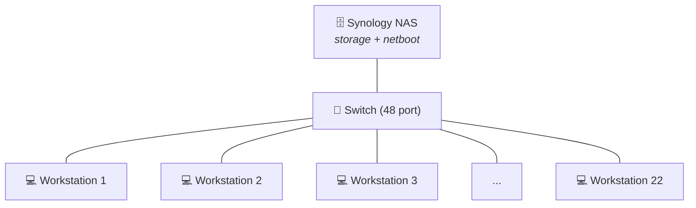

# Laboratory Infrastructure

## The room

Room A205 is approximately 10 by 12 meters, projected to a maximum of 120 participants distributed over 22 stations.

Flexible layouts are allowed as long as they avoid the main structural pillar and the two doors.

Within these constraints any layout can be requested. If you are a prospective user, feel free to specify your preferred layout using the [web tool](https://aixlab-d3-nsbe-nms.github.io/a205_layout). 

!!! example ""
    Make sure to save your layout in an `xml` file if you'd like it to be added to the template layouts.

??? example "Interactive lab layout tool — click to expand and try it"
    <iframe src="https://aixlab-d3-nsbe-nms.github.io/a205_layout" width="100%" height="600" 
            style="border: 1px solid #ccc; border-radius: 8px;" loading="lazy">
    </iframe>

    

      <a href="https://aixlab-d3-nsbe-nms.github.io/a205_layout" target="_blank">Open in new tab ↗</a>
    

## Local Network

The technical floor features 22 outlets with RJ45 ethernet ports, one per workstation. On the opposite end, these converge into a 48 port switch. 

Additionally, there is a Synology NAS, used for data storage and netboot, connected to the switch.  

The lab LAN is local and offline (cannot be accessed via internet), with the format 192.168.10.XXX. IP addresses should be set according with the following rules:

| 
IP Range
   | 
Use For
 |
| ----------- | --------------------- |
| 0 - 99      | Free                  |
| 100         | controller / labadmin |
| 101-122     | Workstations 1 to 22  |
| 123-200     | Free                  |
| 201         | Synology NAS          |
| 202-254     | Free                  |

IP addresses are, by default, assigned in the machine they correspond to (e.g., Workstation 01 should be at 192.168.10.101).

 

## Synology NAS

The lab server is a 12-bay Synology RS3621XS+ with 12x 16Tb discs and used for 3 purposes described below.

### 1. Storage server

The storage server can be accessed via 2 main ways:

- `HTTP` on `192.168.10.201:5000`. Use this method to edit settings such as user permissions (members of the lab), add new shared volumes and do periodic health checks.

 - via `FPT` or `SMB (Samba)` on the same IP (not the same port, let your computer handle that).

 The current convention is one volume per User / Principal Investigator. Different projects should use different subfolders. 

 All shared volumes are access restricted for data privacy, except `datadump` and `images`, which are completely open, unauthenticated access (including write access).

The `datadump` folder is used for data backup after every experiment. Each workstation sends a copy of the local data saved during experiments to `datadump`. After backup confirmed, data should be copied to the appropriate volume `JohnDoe/thisExperiment` and deleted from `datadump`.

`images` stores system images, usually Linux Mint 22, Ubuntu 24.04 or Windows 11. See more in the next section on the PXE Server.

???+ question "Reasoning"
    `datadump` is set to read and write permissions from unauthenticated users so that workstations, which should not have any lab credentials stored, can backup their data.

!!! warning "After every experiment backup"
    Make sure `datadump` is empty.

### 2. PXE Server

The Synology also has an active Pre-boot eXecution Environment (PXE) with [Clonezilla Live](https://clonezilla.org/livepxe.php).

This allows booting from Ethernet into a Clonezilla environment to restore or backup a system image.

!!! question "Why PXE"
    Experiment workstations need to have software tailored for the event in the lab (experiments, AI workshops, etc).

    Usually the lab admin or researcher will setup a system image configured for the experiment and all computers are cloned from it. 

    The typical workflow involves booting from a flashdrive burned with Clonezilla Live, and an external hard drive with the target system image. Flashing 22 computers this way can only be done sequentially, unless you have 22 flash drives and 22 external hard drives.

    Using the Synology NAS as a PXE server solves these two problems: computers boot into clonezilla via Ethernet (any lab eth port will do) and access the system images stored in the shared volume `images`, making it possible to flash multiple computers simultaneously.

### 3. DHCP Server

In the event that a computer doesn't have a defined IP address, it should still be able to join the LAN. the Synology NAS has an active DHCP Server to attribute an available IP to a machine that requests it, but this is not usually needed since you should set the IP address manually anyway.

## Experiment structure

todo: schematic of workstation with recording devices

### Workstation setup

todo: operating system, participant accounts, internet access

### Data streams and storage

### Control and automation

ansible