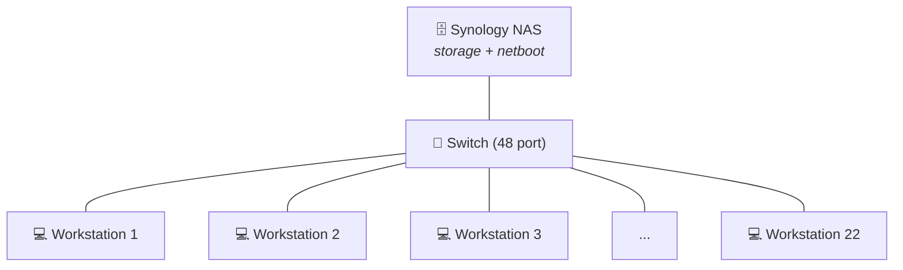
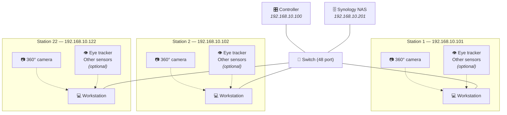
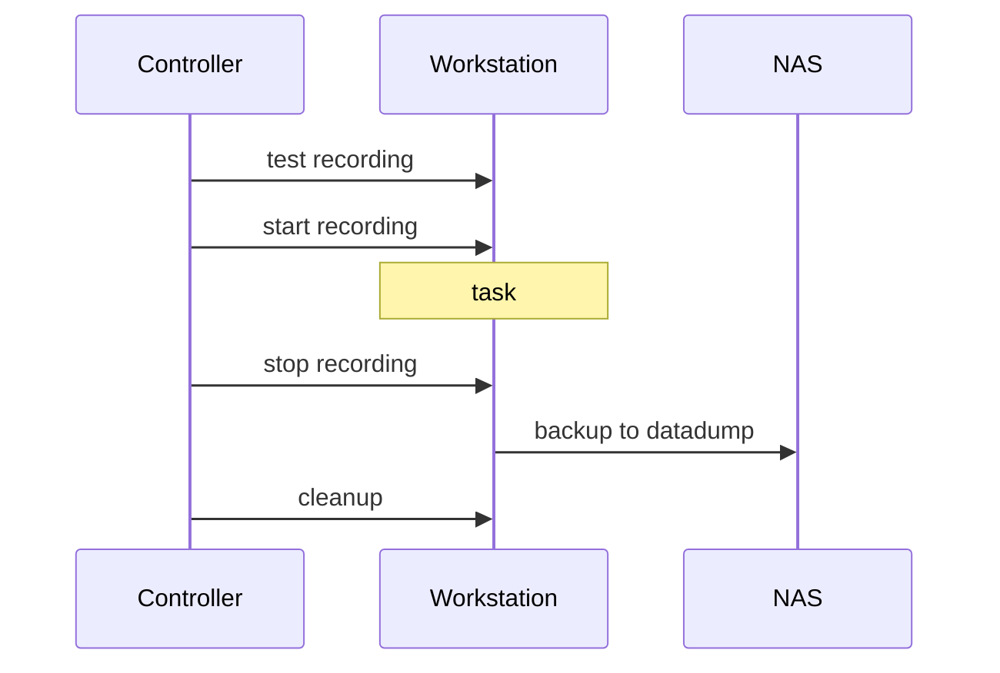

# Laboratory Infrastructure

## The room

Room A205 is approximately 10 by 12 meters, projected to a maximum of 120 participants distributed over 22 stations.

Flexible layouts are allowed as long as they avoid the main structural pillar and the two doors.

Within these constraints any layout can be requested. If you are a prospective user, feel free to specify your preferred layout using the [web tool](https://aixlab-d3-nsbe-nms.github.io/a205_layout). 

!!! example ""
    Make sure to save your layout in an `xml` file if you'd like it to be added to the template layouts.

??? example "Interactive lab layout tool — click to expand and try it"
    <iframe src="https://aixlab-d3-nsbe-nms.github.io/a205_layout" width="100%" height="600" 
            style="border: 1px solid #ccc; border-radius: 8px;" loading="lazy">
    </iframe>

    <p style="text-align: right;">
      <a href="https://aixlab-d3-nsbe-nms.github.io/a205_layout" target="_blank">Open in new tab ↗</a>
    </p>

## Local Network

The technical floor features 22 outlets with RJ45 ethernet ports, one per workstation. On the opposite end, these converge into a 48 port switch. 

Additionally, there is a Synology NAS, used for data storage and netboot, connected to the switch.  




The lab LAN is local and offline (cannot be accessed via internet), with the format 192.168.10.XXX. IP addresses should be set according with the following rules:


| <div style="width: 130px;">IP Range</div>   | <div style="width: 200px;">Use For</div> |
| ----------- | --------------------- |
| 0 - 99      | Free                  |
| 100         | controller / labadmin |
| 101-122     | Workstations 1 to 22  |
| 123-200     | Free                  |
| 201         | Synology NAS          |
| 202-254     | Free                  |


IP addresses are, by default, assigned in the machine they correspond to (e.g., Workstation 01 should be at 192.168.10.101).

<br>

## Synology NAS

The lab server is a 12-bay Synology RS3621XS+ with 12x 16Tb discs and used for 3 purposes described below.

### 1. Storage server

The storage server can be accessed via 2 main ways:

- `HTTP` on `192.168.10.201:5000`. Use this method to edit settings such as user permissions (members of the lab), add new shared volumes and do periodic health checks.

 - via `FPT` or `SMB (Samba)` on the same IP (not the same port, let your computer handle that).

 The current convention is one volume per User / Principal Investigator. Different projects should use different subfolders. 

 All shared volumes are access restricted for data privacy, except `datadump` and `images`, which are completely open, unauthenticated access (including write access).


The `datadump` folder is used for data backup after every experiment. Each workstation sends a copy of the local data saved during experiments to `datadump`. After backup confirmed, data should be copied to the appropriate volume `JohnDoe/thisExperiment` and deleted from `datadump`.

`images` stores system images, usually Linux Mint 22, Ubuntu 24.04 or Windows 11. See more in the next section on the PXE Server.


???+ question "Reasoning"
    `datadump` is set to read and write permissions from unauthenticated users so that workstations, which should not have any lab credentials stored, can backup their data.

!!! warning "After every experiment backup"
    Make sure `datadump` is empty.


### 2. PXE Server

The Synology also has an active Pre-boot eXecution Environment (PXE) with [Clonezilla Live](https://clonezilla.org/livepxe.php).

This allows booting from Ethernet into a Clonezilla environment to restore or backup a system image.

!!! question "Why PXE"
    Experiment workstations need to have software tailored for the event in the lab (experiments, AI workshops, etc).

    Usually the lab admin or researcher will setup a system image configured for the experiment and all computers are cloned from it. 

    The typical workflow involves booting from a flashdrive burned with Clonezilla Live, and an external hard drive with the target system image. Flashing 22 computers this way can only be done sequentially, unless you have 22 flash drives and 22 external hard drives.

    Using the Synology NAS as a PXE server solves these two problems: computers boot into clonezilla via Ethernet (any lab eth port will do) and access the system images stored in the shared volume `images`, making it possible to flash multiple computers simultaneously.

### 3. DHCP Server

In the event that a computer doesn't have a defined IP address, it should still be able to join the LAN. the Synology NAS has an active DHCP Server to attribute an available IP to a machine that requests it, but this is not usually needed since you should set the IP address manually anyway.


## Workstation setup

### Operating system

Lab workstations run **Linux**, with two recommended distributions:

- **Linux Mint** — preferred choice for experiment workstations.
- **Ubuntu 24.04 LTS** — equivalent alternative, used where Mint is not suitable.

**Windows is avoided** for experiment machines. It is considered inappropriate due to mandatory online login requirements, intrusive background processes, forced updates, and general OS interference that can disrupt timing-sensitive recordings or task execution. Windows workstations may exist for administrative or analysis purposes, but not for running experiments.

### User accounts

Each experiment workstation is configured with **two local accounts**:

|  <div style="width:80px">Account</div> | Type | Purpose | Authentication |
|---|---|---|---|
| `labadmin` | Administrator (sudo) | Installation, configuration, maintenance, and troubleshooting. | Password-protected (credentials held by lab admins). |
| `participant` | Standard (no sudo) | Used during experiment sessions by participants and operators. | **Passwordless**, with **automatic login** on boot. |

The `participant` account is intentionally stripped of friction: no password prompt, no login screen, no account chooser. This ensures a clean, distraction-free start to every session and avoids participants ever seeing administrative interfaces. Because the account has no administrative privileges, system-level changes cannot be made from within a session. Installation and configuration always go through `labadmin`.

!!! warning
    Passwordless login on `participant` accounts relies on the assumption that **physical access to the lab is restricted**. Since the `datadump` storage folder is the only location with open access, it is crucial that it does not contain data. See more in [storage server](#1-storage-server).


### Network access

Experiment workstations connect to the institutional network via **eduroam**, using **PEAP with MSCHAPv2** authentication.

A **shared list of eduroam credential sets** was provided by **IT** and is **stored on the Synology NAS**. These credentials should be used for all lab equipment.

## Experiment structure


Acquisitions in the lab are designed to be **task-agnostic**: the lab provides a standardised recording infrastructure, and the experimental task itself (cognitive paradigm, AI workshop, behavioural study, etc.) runs on top of it.

The typical setup brings a group of participants into the lab, distributed across the 22 stations. Each station is a self-contained recording unit with:

- A **workstation computer**, cloned from a common system image (see [PXE Server](#2-pxe-server)) so that every station is software-identical.
- A **360° omnidirectional camera**, currently the [Meeting Owl 4+](https://owllabs.com/products/meeting-owl-4-plus), USB-C connected to the workstation.
- Optional peripherals depending on the experiment (eye tracker, physiological sensors, VR hedasets, etc.).

All workstations are wired into the lab [LAN](#local-network) and coordinated by a **controller machine** (`192.168.10.100`), which issues start/stop commands, monitors recording status, and triggers post-experiment backup to `datadump` on the NAS. More on controller setup can be found in [Control and Automation](#control-and-automation).




!!! info "Reading the schematic"
    Solid lines are **always-present** connections (camera + LAN). Dashed lines indicate **optional** peripherals that depend on the specific experiment being run.

A typical experiment will have the following timeline:

[this is a comment]: #
[symbols can be inserted using a reference between colon, for example :clapper:]: #
[however mermaid does not allow that syntax inside the flowcharts. instead copy the emoji directly from emojipedia]: #
[emoji reference in https://unicode.org/emoji/charts/full-emoji-list.html and https://emojipedia.org/]: #





## Data streams and storage

### Local recording location

Each workstation writes all experiment data to a **top-level directory at the filesystem root** called `/data`.

This location is deliberate. Placing `data` at the root (rather than inside a user's home directory) ensures that **both `labadmin` and `participant` accounts can read and write to it without permission conflicts**. It also keeps recordings outside any single account's home, which simplifies backup, cleanup, and reinstalls.

Inside `/data`, there is **one subfolder per recording device**. Each device writes only to its own subfolder, which keeps streams cleanly separated and makes per-device troubleshooting straightforward.

### Local directory structure

A typical workstation's `/data` directory should look like this:

```
/data
├── screen/                     # the computer screen
│   └── <recording files>
├── owl/                        # omnidirectional camera
│   └── <recording files>
├── eyetracker/
│   └── <recording files>
├── microphone/
│   └── <recording files>
├── eeg/
│   └── <recording files>
└── motion-capture/
│   └── <recording files>
│ ...
```

The exact set of subfolders depends on which devices are recording on a given workstation. The naming convention is **one folder per device, named after the device or modality** (not after the manufacturer or software).

### Synchronization to the storage server

At the end of an experiment session, the entire contents of `/data` are **synchronized to the Synology NAS**, into a folder named after the originating workstation:

```
NAS:/datadump
├── workstation-1/
│   ├── screen/
│   ├── owl/
│   └── ...
├── workstation-2/
│   ├── screen/
│   ├── owl/
│   └── ...
├── workstation-3/
│   └── ...
└── ...
```

This means the **server-side layout mirrors the local layout**, with the workstation name as an extra top-level grouping.


## Control and automation

Workstation control across the lab is handled with [**Ansible**](https://docs.ansible.com/). Rather than logging into each machine individually to start recordings, install software, or move data, the operator runs playbooks from a single control node and Ansible executes the steps on every targeted workstation in parallel.

The lab maintains two sets of Ansible artefacts, kept together with other lab tooling in a dedicated git repository:

**Repository:** [`orchestra/ansible`](https://github.com/AIxlab-D3-NSBE-NMS/orchestra/tree/main/ansible)

- **Inventory files (`inventory.ini`)** — one per experiment (or experiment configuration). Each inventory file declares which workstations participate in that experiment and groups them as needed. 
- **Playbook files (`*.yml`)** — one per operational action. The current set covers:
    - Uploading experiment files to the target workstations.
    - Installing general system packages via `apt`.
    - Starting recording on all targeted workstations.
    - Stopping recording.
    - Uploading recorded data from `/data` to the Synology NAS.
    - Rebooting workstations.

Together, the `inventory` + `playbook` pair is enough to drive a full experiment session end-to-end without manually touching individual machines.

### Connection model

Ansible connects to workstations over **SSH**, using **one of two accounts depending on the task**:

| Account | Used for |
|---|---|
| `labadmin` | Tasks that require elevated privileges — `apt` installs, system configuration, reboots, anything needing `sudo`. |
| `participant` | Tasks that run in the participant's normal environment — starting/stopping recordings, uploading session data, managing experiment files. |

!!! tip "LAN vs WiFi"
    `ansible` relies on `ssh`, which is supported on ethernet or wifi. On occasion, we have had to use wifi, but it is not recommended since wifi connections may drop and they require more careful confirmation that the commands went through. They also have higher latency and IP addresses often change. All those issues are solved by using the lab LAN over ethernet.

### SSH keys

Authentication is **key-based, not password-based**. Each workstation has its **authorized SSH keys pre-installed** on both the `labadmin` and `participant` accounts, so the Ansible control node can reach any machine without prompting for credentials during standard tasks.

!!! info "SSH keys"
    SSH keys are generated on one machine (example, the lab admin's computer) and deployed to all workstations. The stored system images already contain the keys, so unless a system image is built from scratch there is no need to deploy ssh keys.  

!!! info "`ansible` for `sudo` commands"
    If you run `ansible` commands that require privilege escalation, like `reboot`, you need to supply the admin pass via [`--ask-become-pass`](https://docs.ansible.com/projects/ansible/latest/playbook_guide/playbooks_privilege_escalation.html).


!!! question "New to Ansible?"
    If you have not used Ansible before, the official [**"Getting started with Ansible"**](https://docs.ansible.com/ansible/latest/getting_started/index.html) guide is the recommended entry point and covers everything needed to read and run the lab's playbooks.

## Inventory

If you have internal access, [equipment inventory is listed here](https://novasbe365.sharepoint.com/:x:/r/sites/D3Institute/Shared%20Documents/01.%20AI%20Experimentation%20Lab/09.%20Equipment/D3_AIXLab_Inventory_2026.xlsx?d=w12fc23e8e89b419ba38152fd8f22bcc2&csf=1&web=1&e=SZdLSl).

## Public calendar

Feel free to [view or subscribe](https://outlook.office365.com/owa/calendar/dd163b1e835e4b8fb996e7070d696c2c@novasbe.pt/041b0f8ab2da43edac90f33ed20a22565499034006862705831/calendar.html).
