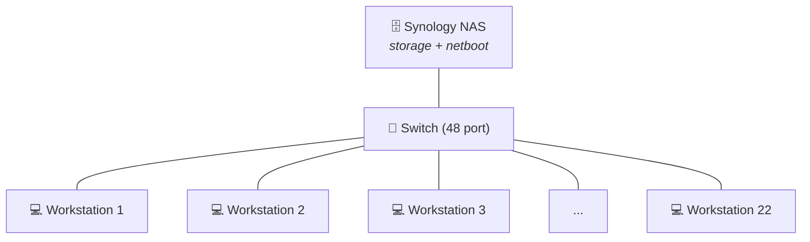

# Laboratory Infrastructure

## The room

Room A205 is approximately 10 by 12 meters, projected to a maximum of 120 participants distributed over 22 stations.

Flexible layouts are allowed as long as they avoid the main structural pillar and the two doors.

Within these constraints any layout can be requested. If you are a prospective user, feel free to specify your preferred layout using the [web tool](https://aixlab-d3-nsbe-nms.github.io/a205_layout). 

!!! info ""
    Make sure to save your layout in an `xml` file if you'd like it to be added to the template layouts.

## Local Network

The technical floor features 22 outlets with RJ45 ethernet ports, one per workstation. On the opposite end, these converge into a 48 port switch. 

Additionally, there is a Synology NAS, used for data storage and netboot, connected to the switch.  

The lab LAN is local and offline (cannot be accessed via internet). IPs arestatically attributed according with the following rules:

| IP range    | Use for               |
| ----------- | --------------------- |
| 0 - 99      | Free                  |
| 100         | controller / labadmin |
| 101-122     | Workstations 1 to 22  |
| 123-200     | Free                  |
| 201         | Synology NAS          |
| 202-254     | Free                  |